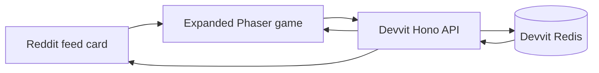

## Thread Quest Daily

Thread Quest Daily is a 75-second route puzzle that runs inside a Reddit post.
Every day brings a deterministic 7x8 expedition map. Players spend energy to
cross terrain, light at least two beacons, and reach the north gate before time
runs out. Route variety builds a combo, relay tiles restore energy, and a
one-use Overcharge can rescue a run.

Each redditor keeps their best score for the day. Those personal bests add to a
shared community signal stored in Devvit Redis, so every run moves the post
toward a visible subreddit milestone.

- App: https://developers.reddit.com/apps/thread-quest-daily
- Repository: https://github.com/nonggde/thread-quest-daily
- Demo: https://www.reddit.com/r/thread_quest_dail_dev/comments/1uw5rza/thread_quest_daily_light_two_beacons_and_reach/
- Built for: https://redditgameswithahook.devpost.com/

## Why It Fits Reddit

- The playable feed card shows live community score and run count.
- The expanded view launches instantly from the post.
- A daily seed gives everyone the same map and a reason to compare routes.
- Only a player's improved score changes the shared total, preventing repeat-run inflation.
- Installation creates the first playable post automatically; moderators can create more from the subreddit menu.

## Architecture



The client uses Phaser 4 and Vite. The Devvit Web server uses Hono and stores
daily per-player bests plus aggregate community milestones in Redis.

## Local Development

Node.js 22.2 or newer is required.

```bash
npm install
npm run type-check
npm run lint
npm run build
npm run dev
```

## Commands

- `npm run dev`: Starts a Devvit playtest.
- `npm run build`: Builds the client and server bundles.
- `npm run deploy`: Validates and uploads a new app version.
- `npm run launch`: Uploads and submits an app version for review.
- `npm run login`: Connects the Devvit CLI to Reddit.

## Submission

The uploaded Devvit app is `thread-quest-daily`. Demo and Devpost links are
recorded in `submission/reddit-games-submission.md`. The test subreddit is
private and uses Reddit's official `dr-admin-approve` app for judge access, as
allowed by the hackathon rules.
